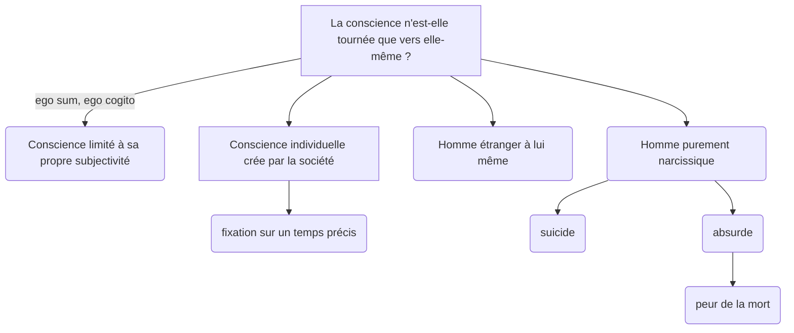

```mermaid
graph TD;
    A[La conscience n'est-elle tournée que vers elle-même ?] --> |ego sum, ego cogito| B(Conscience limité à sa propre subjectivité);
    A --> C(Homme purement narcissique );
    A --> D(Homme étranger à lui même);
    A --> E[Conscience individuelle crée par la société];
    E--> G(fixation sur un temps précis);
    C --> F(suicide);
    C --> T(absurde)
    T--> J(peur de la mort)
   
```
