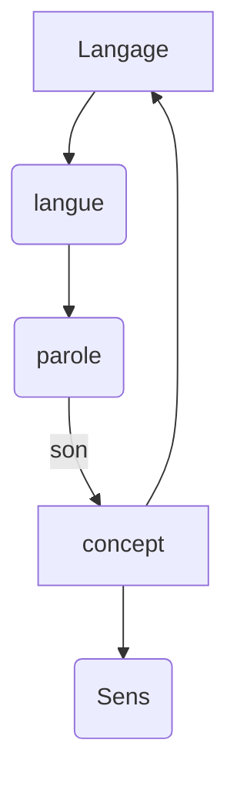

Son

, langue, parole, 

Langue: particulière
dimension ethnique (territoire (pas pays))

Anglais (pas langue de territoire)(=Latin)

Polyglotte

Pense-t-on differement d uner langue à l'autre ?

Racialisme : langue civilisé et langue primitive
Barbare: celui qui nre parle pas ma langue

Traductor : traitre

==Langue maternelle==
- Aquisition de la langue (nous naissons infans (non locuteur)) Le Tambour (gunter grass) #oeuvre 
Enfant mythique (ne parle plus)