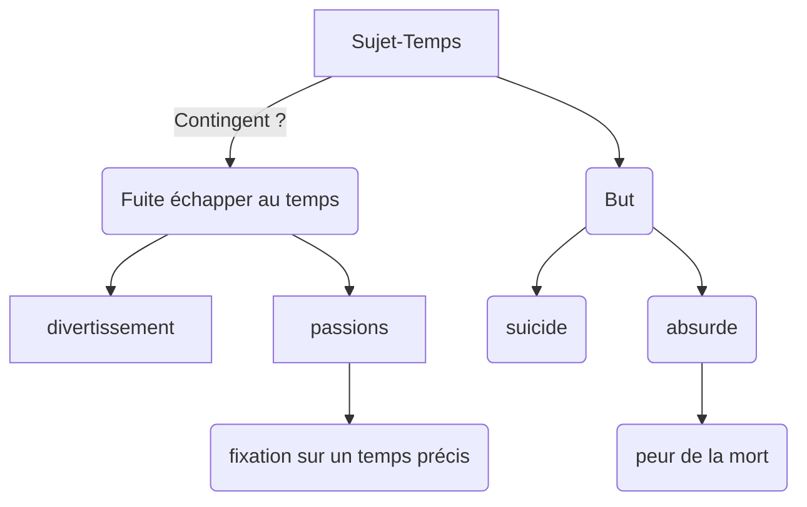

Exister, ce n’est pas seulement être présent quelque part, ni seulement vivre (aller d’un point à un autre, dans le cadre d’un temps dit objectif, de la naissance à la mort). Exister, c’est habiter le temps, c’est avoir conscience de vivre, c’est chercher un sens authentique à sa vie, et à la vie en général. C’est, selon la formule de Heidegger, « se trouver là dans ce monde » (en allemand, exister se dit dasein, « être là »).

>[!QUESTION]
>Peut-on assumer cette condition temporelle sans se perdre
>En quoi les passions emprisonnent-elles l'homme dans le temps
>

 pages 58 et 59
Expliquer par écrit le type de rapport existant entre le sujet conscient de sa temporalité , entre contingence et nécessité #notion , et sa perception de
l'écoulement de la durée .

## Vivre le présent/vivre au présent
### temps et diveritssement
"échapper au temps"
>[!EXEMPLE]
>crème antirides
>idée d'immortalité de l'âme

divertissement : ne pas regarder le temps en face #def

### temps et passions : 
fixation passsé(nostalgie)/ présent(frivolité)/ futur(ambition)

### Sujet conscient et temporalité
### existence/essence :

[[Sarte]] -> existence  avant essence
essence: ce sui définie la nature profonde d'une réalité et par là sa fonction et son rôle#def 
Sans créateur : homme contingent
exister : être dans le temps , être-temps
-> multimort

**peur de la mort:** sens de la vie / la rend vaine

Mort : élément de la pensée pur
-> crée de l'art
-> amour ou haissement
se situer dans le temps
production 

Mort = oubli
temps sociale du calendrier
temps mémoriel  -> fête des morts 
mort : initiale

être/existence #notion
>[!FAQ]
>l'être arrive dans la temporalité par son existence ?

existence: comparaison 
temps : mort
vie : construction de rdv "un jour mon prince viendra": cristallisation de l'anticipation 
-> pensée mythique : "il était une fois"
osciellation entre temps avant et après car nous savons notre finitude
non-temps: ouroboros reprise du cadran de la montre du 

l'animal-machine cartésien
animal ait qui il est sans conscincce, pa s
instinct: anti temps

panne d'internet 1900
>[!FAQ]
fin des temps

unité, pluralité, singularité : 
du temps

3à trajectoires paralleles dans un temps commun
partagé le temps = temps commun
le temps nous unient-il ou nous sépart-il ?

>[!FAQ]
>Le suicide est-il une mauvaise chose ?
>absurde, suicide uniquement en rapport avec la temporalité ? 

Cicéron : droit de l'homme à s'ôter la vie : être son propre démurge
Causalité de l'existence  ne dépend pas de notre libre arbitre

démurge #antique 
je peux décider de naître ou demourrir

suicide : s'ôter la vie

désir de ne plus exister ou volonté de ne plus souffrir :
nihilisme : Idéologie qui rejette toute croyance ; qui refuse toute contrainte sociale. #def

[Nieztch] : existence contigente

Il a des vies qui valent plus que d'autres 
Cicéron s'ouvre les veines pour échapper à l'injustice : grandeur de l'homme

"plus il y a de déterminisme qui pèse sur moi plus il y a de liberté"  
>"il faut imaginéer Sisyphe heureux"
-Camus

-> il y a des cancéreux heureux

historiquement : toutes les civilisations qui furent confrontés à l'urgence des crises on surmonté ces déterminsime en fabriqant des chefs d'oeuvre
La fatalité écrasante nous rend libre

point le plus haut de la temporalité, vivre est une punition qui nous rend étrangement heureux
[[Roseau pensant Pascal]]

>[!FAQ]
>objectivement : valeur valeur : subjectif 

Nou n'échappons pas à la flèche du temps : 
âge de la vie :  
 -  vieux cpon : explique comment il vous faudrait vivre
 - jeune con : renvoie le vieux monde dans les oubliette

[[ VoyellesArthur Rimbaud]]

monde=jouissance + souffrance

présent du présent : saint augustin 
présent du passé, présent du futur 
"assurance vie" : produit financier

Les Visiteurs : 
les couloirs du temps

pensée le temps :
connu mais espérer ou redouter 
rapport au temps d'ordre
peinture est une chose mental Léonard de Vinci 

Freud 
Gérard de Nerval 

être et existence: 
ex : 
table : être (elle te fait mal, ) matière, chose , dans la durabilité 
personne : ne se contente pas d'être mais existe avant d'être. QQn : agir dans l'espace et dans le temps
[[Sarte]]: paraphrase de la philo allemande de [[Husserl]]: phénoménologie : capacité pour la conscience de créer le monde et les obkjets dans le monde #def 
*res cogitans*

l'homme ne choisis pas d'exister

sentiment de l'absurde
 temps : injonctrion, contrainte : 52 semaines dans l'année
experience du temps
![[Exister dans le temps]]